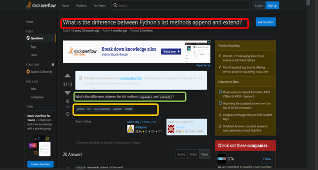
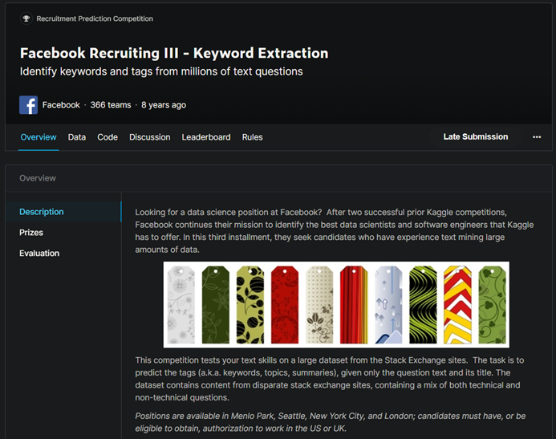

# StackOverflow Question Tagging Project:

## Business Problem Case Study :

### Description

*Stack Overflow is the largest, most trusted online community for developers to learn, share their programming knowledge, and build their careers.* 

Stack Overflow is something which every programmer use one way or another. Each month, over 50 million developers come to Stack Overflow to learn, share their knowledge, and build their careers. It features questions and answers on a wide range of topics in computer programming. The website serves as a platform for users to ask and answer questions, and, through membership and active participation, to vote questions and answers up or down and edit questions and answers in a fashion similar to a wiki or Digg. As of April 2014 Stack Overflow has over 4,000,000 registered users, and it exceeded 10,000,000 questions in late August 2015. Based on the type of tags assigned to questions, the top eight most discussed topics on the site are: Java, JavaScript, C#, PHP, Android, jQuery, Python and HTML.

## Problem Statemtent

*Suggest the tags based on the content that was there in the question posted on Stackoverflow.*

- If you see the `Red colour Highlighted Box Sentence` in the given image it is called `Title`.
- If you see the `Gren colour Highlighted Box Sentence` in the given image it is called `Description`.
- If you see the `Orange colour Highlighted Box Words` in the given image it is called `Tags`.

#### Working Of Stack overflow in Simple Way:

 Anybody can Go an Ask a Question Basically They have to Provide `Title of the Question` , `Description`
 and  `Tags`.
 
Note : Sometimes we have to give `Tags` When we are asking Question on Stack overflow.If we do not give tags it is automatically Generated by the Stack overflow Website with help of their Models.
 
So if we have right `Tags` Given to us or Generate by the Stack oveflow Website we can reach to those People who can answer the question it very fast. 

For Example: If You See the first image of Stack overflow website where the question asked by the user `What is the difference between Python's list methods append and extend?` and  the  `tags`  is given by the user  with the help of both of them we have to reach to the person or group of people  who have master in the answering the question  like this.If you see our second image the person `kender` have answerd this type of question on previously  in the same way he will answer this quetion also.So we are are reaching the person or group of people in this way that they answer this type of question very fast.

## Data Source :

Dataset Link:
